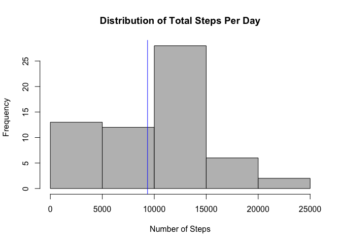
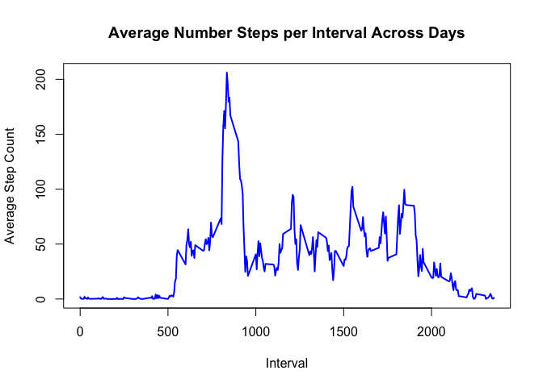
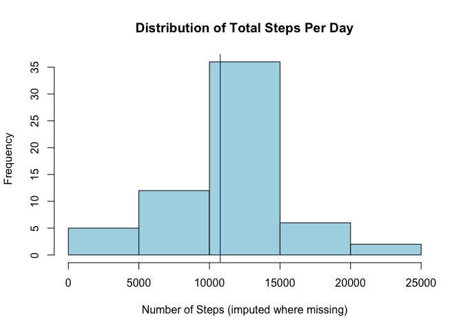
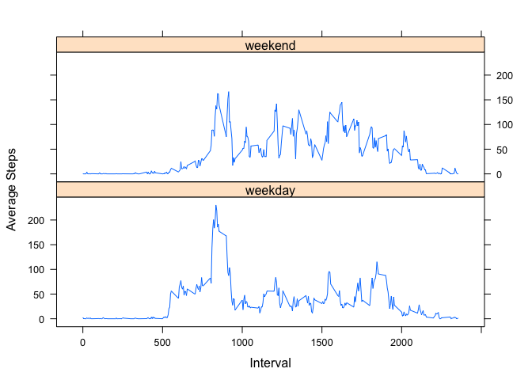

# Reproducible Research: Peer Assessment 1


### Loading and preprocessing the data
*Assumes ZIP file has already been downloaded. Set working directory, unzip and read CSV.*


```r
setwd("/Users/lisa/Documents/data science/assignments/5-ReproducibleResearch")
unzip("activity.zip")
act <- read.csv ("activity.csv", sep=",",header=T, stringsAsFactors=FALSE)
```


### What is mean total number of steps taken per day?
**Calculate total by date, then mean and median across dates.**


```r
totstep <- aggregate(act$steps, list(act$date), sum, na.rm=TRUE)
colnames(totstep) <- c("Date", "TotalSteps")
avgstepday <- round(mean(as.numeric(totstep$TotalSteps), na.rm=TRUE), 1)
medstepday <- round(median(as.numeric(totstep$TotalSteps), na.rm=TRUE), 1)
```

The mean number of steps per day is 9354.2.
The median number of steps per day is 10395.


**Create a histogram of the frequency of each range of daily step totals. Include mean line.**


```r
par(mfrow=c(1,1))
with(totstep,
     hist(TotalSteps,
          col="gray",
          main = "Distribution of Total Steps Per Day", 
          xlab="Number of Steps"))
abline(v=avgstepday, col="Blue")
```

<!-- -->


### What is the average daily activity pattern?
**Create a time series plot of 5-minute intervals and average number of steps taken across days.**


```r
avgint <- aggregate(act$steps, list(act$interval), mean, na.rm=TRUE)
colnames(avgint) <- c("Interval", "AvgSteps")
with(avgint, plot(Interval, AvgSteps,
             type="l", 
             main="Average Number Steps per Interval Across Days",
             xlab= "Interval", 
             ylab= "Average Step Count", 
             col="blue", 
             lwd=2))
```

<!-- -->


**Determine which interval, on average across all days, contains the maximum steps.**


```r
maxstep <- max(avgint$AvgSteps)
avgint[avgint$AvgSteps == maxstep, ]
```

```
##     Interval AvgSteps
## 104      835 206.1698
```


### Imputing missing values
**Calculate and report the total number of missing values in the dataset.**


```r
nmiss <- nrow(act[is.na(act$steps)==TRUE,])
```

There are 2304 rows with missing values.


**Create a new dataset that is equal to the original dataset but with the missing data filled in. NA values will be replaced with the average value for that interval across days. Recalculate mean and median total dail step counts.**


```r
library(plyr)
impval <- function(x) replace(x, is.na(x), mean(x, na.rm = TRUE))
impact <- ddply(act, ~ interval, transform, steps = round(impval(steps), 0))
```

**Calculate and report the mean and median total number of steps taken per day and create a histogram of the total number of steps taken each day, including imputed values.**


```r
totimpstep <- aggregate(impact$steps, list(impact$date), sum)
colnames(totimpstep) <- c("Date", "TotalSteps")
avgimpstepday <- mean(as.numeric(totimpstep$TotalSteps), na.rm=TRUE)
medimpstepday <- median(as.numeric(totimpstep$TotalSteps), na.rm=TRUE)

with(totimpstep,
     hist(TotalSteps,
          col="lightblue",
          main = "Distribution of Total Steps Per Day", 
          xlab="Number of Steps (imputed where missing)"))
abline(v=avgimpstepday, col="navy")
```

<!-- -->

Including imputed values, the new mean number of steps per day is 10766, *versus* the previous value of 9354.2.  
Including imputed values, the new median number of steps per day is 10762 *versus* the previous value of 10395.  


Replacing NAs with values imputed based on interval increases the mean and median daily totals because imputed steps are now added on an interval-by-interval basis, increasing individual daily totals for days that had missing values. 


### Are there differences in activity patterns between weekdays and weekends?
**Using dataset with imputed values, find day of week for each date and create a new factor variable in the dataset with two levels – “weekday” and “weekend” indicating whether a given date is a weekday or weekend day.**


```r
dimpact <- impact
dimpact$day <- weekdays(as.Date(impact$date))
dimpact$daytype[dimpact$day %in% c("Saturday", "Sunday")] <- "weekend"
dimpact$daytype[is.na(dimpact$daytype)==TRUE] <- "weekday"
dimpact$daytype <- as.factor(dimpact$daytype)
```


**Make a panel plot containing a time series plot of the 5-minute interval (x-axis) and the average number of steps taken, averaged across all weekday days or weekend days (y-axis).**


```r
avgdaytyp <- aggregate(dimpact$steps, list(dimpact$interval, dimpact$daytype), mean)
colnames(avgdaytyp) <- c("Interval", "DayType", "AvgSteps")
library(lattice)
xyplot(AvgSteps ~ Interval | DayType,
       data=avgdaytyp,
       type="l",
       layout=c(1,2),
       ylab="Average Steps")
```

<!-- -->

On weekdays, activity spikes earlier in the day. This spike is less pronounced on weekends, though overall activity levels are higher during weekends.
